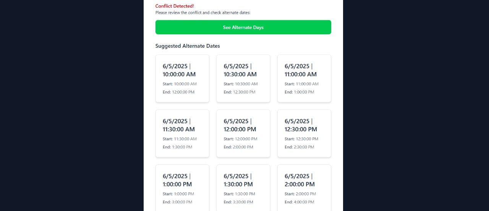

# Meeting Scheduler with Conflict Detection


A full-stack meeting scheduler application with conflict detection, real-time updates, and advanced features such as best slot suggestions and user authentication.

## Tech Stack

- **Frontend**: React (with hooks), TailwindCSS for UI styling
- **Backend**: Node.js with Express
- **Database**: MongoDB


## Key Features

### 1. User Authentication

- **Register/Login**: Allows users to sign up and log in to the app.
- **JWT-based Authentication**: Ensures secure login sessions using JWT tokens.
- **Role-based Access**: Supports different roles (User vs Admin).


### 2. Meeting Creation

- **Create Meetings**: Users can create meetings with:
  - Title
  - Description
  - Start and End Time
  - Participants (via email)
- **Conflict Detection**: The backend checks for scheduling conflicts before saving a new meeting.


### 3. Calendar View (Frontend)

- **Weekly/Daily Views**: Users can view their meetings in either a weekly or daily view.
- **Conflict Highlighting**: Conflicting meetings are highlighted for easy identification.

### 4. Conflict Detection

- **Prevent Double-Booking**: The backend ensures that users cannot book overlapping meetings.
- **Rescheduling Suggestions**: If a conflict is detected, the app suggests alternate available times.

### User's Profile(showing the current date's meeting):


### Admin portal:

- **ROLE**: Admins can delete user as well as any meeting.

## Installation

Follow these steps to set up the project locally:

1. Clone the repository:
   ```bash
   git clone https://github.com/nandiayan73/Meeting_Scheduler.git

2. Navigate to the project directory:
    cd Meeting_Scheduler

3. Navigate to the project directory:
    Install all dependencies for both frontend and backend:

4. Start both the client (React) and the server (Node.js + Express) together:

    npm run dev