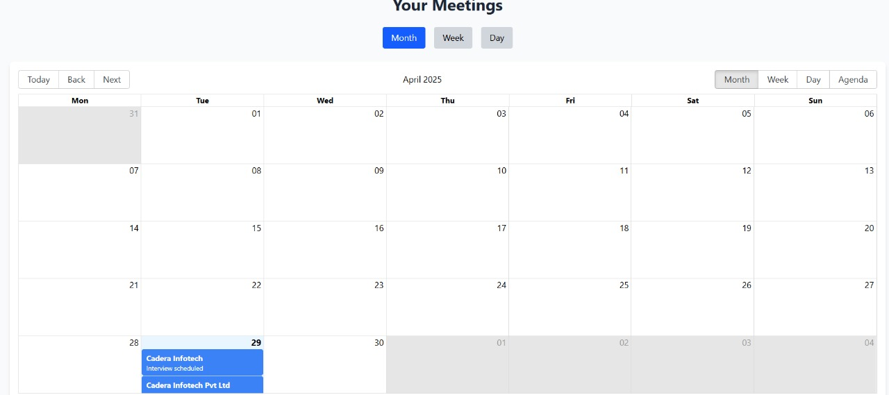

# Meeting Scheduler with Conflict Detection


A full-stack meeting scheduler application with conflict detection, real-time updates, and advanced features such as best slot suggestions and user authentication.

# Tech Stack

- **Frontend**: React (with hooks), TailwindCSS for UI styling
- **Backend**: Node.js with Express
- **Database**: MongoDB


# Key Features

### 1. User Authentication

- **Register/Login**: Allows users to sign up and log in to the app.
- **JWT-based Authentication**: Ensures secure login sessions using JWT tokens.
- **🍪 Cookie-Based Authentication**: Uses HTTP-only cookies to store JWT tokens, enabling session-like authentication in a stateless way.

### Admin Authentication
- **Role-based Access Supports different roles (User vs Admin).**


### 2. Meeting Creation

- **Create Meetings**: Users can create meetings with:
  - Title
  - Description
  - Start and End Time
  - Participants (via email)

  - A mail will be sent to the participants upon successful creation of the meeting.
- **Conflict Detection**: The backend checks for scheduling conflicts before saving a new meeting.


### 3. Calendar View (Frontend)

- **Weekly/Daily Views**: Users can view their meetings in either a weekly or daily view.
- **Conflict Highlighting**: Conflicting meetings are highlighted for easy identification.

### 4. Conflict Detection

- **Prevent Double-Booking**: The backend ensures that users cannot book overlapping meetings.
- **Rescheduling Suggestions**: If a conflict is detected, the app suggests alternate available times.

### User's Profile(showing the current date's meeting):


### Admin portal:

- **ROLE**: Admins can delete user as well as any meeting.

# Installation

Follow these steps to set up the project locally:

1. Clone the repository:
   ```bash
   git clone https://github.com/nandiayan73/Meeting-Scheduler

2. Navigate to the project directory:
    ```bash
    cd Meeting-Scheduler

3. Install all dependencies for both frontend and backend:
    ```bash
    npm run install-all

4. Set up environment variables: Create a .env file in the root directory and configure the following variables:
    ```bash
    JWT_SECRET=<Your_JWT_SECRET>
    DB_NAME=<MongoDB_DATABASE_NAME>
    DB_PASS=<MONGODB_PASSWORD>
    COOKIE_SECRET=<COOKIE_SECRET>
    MAIL=<MAILID_FOR_SENDING_MAIL>
    MAILPASSWORD=<APP_PASSWORD>
    ADMIN_SECRET=<Admin_SECRET_FOR_ADMIN_LOGIN>
***IMPORTANT NOTE***
- **Put this .env file inside the Server folder for correct configuration**
- **Enter this admin secret while registering the admin, if not entered in default it will take it as "Admin"**
- **Please enter all the enviroment variables for accurate functioning of the website**

5. Install concurrently if it is not installed:
    ```bash
    npm install concurrently

6. Start both the client (React) and the server (Node.js + Express) together:
    ```bash
    npm run dev


# Meeting Scheduler Backend Models
This repository contains the Mongoose models for a Meeting Scheduler application, including Admin, User, and Meeting models. Each model is designed with best practices for data validation, password security, and relationships between collections.

### Models
**1. Admin Model**
- File: models/Admin.js

- This model defines the schema for Admin users who can manage the platform.

**Schema Fields:**

- email (String, Required, Unique): Admin's email.

- password (String, Required): Hashed password.

**Features:**

- Password is automatically hashed before saving.

- matchPassword method available to compare entered password with the hashed one.
    ```bash
    adminSchema.pre('save', async function (next) { /* Password hashing logic */ });
    adminSchema.methods.matchPassword = async function (enteredPassword) { /* Password comparison */ };

**2. User Model**
- File: models/User.js

- This model defines the schema for Users who will schedule or participate in meetings.

**Schema Fields:**

- name (String, Required): User's full name.

- email (String, Required, Unique): User's email.

- password (String, Required): Hashed password.

- image (String, Default): URL for profile image.

- isAdmin (Boolean, Default: false): Role flag to identify admins.

**Features:**

- Password is automatically hashed before saving.
- matchPassword method available for password comparison.

    ```bash
    userSchema.pre('save', async function (next) { /* Password hashing logic */ });
    userSchema.methods.matchPassword = async function (enteredPassword) { /* Password comparison */ };

**3. Meeting Model**
- File: models/Meeting.js

- This model defines the schema for Meetings created by users.

**Schema Fields:**

- title (String, Required): Meeting title.

- description (String, Optional): Details about the meeting.

- date (Date, Required): Date of the meeting.

- startTime (Date, Required): Start time.

- endTime (Date, Required): End time.

- createdBy (ObjectId, Required): Refers to the User who created the meeting.

- participants (Array of Objects):

- user (ObjectId, Required): Refers to a User participant.

- createdAt (Date, Default: now): Timestamp for when the meeting was created.

- updatedAt (Date, Default: now): Timestamp for when the meeting was last updated.

**Features:**

- Includes references to User for creator and participants.

- Auto-handles timestamps with timestamps: true.

# Contributing
Contributions are welcome! Please fork the repository and submit a pull request with your changes.

# License
This project is licensed under the MIT License. See the LICENSE file for details.

